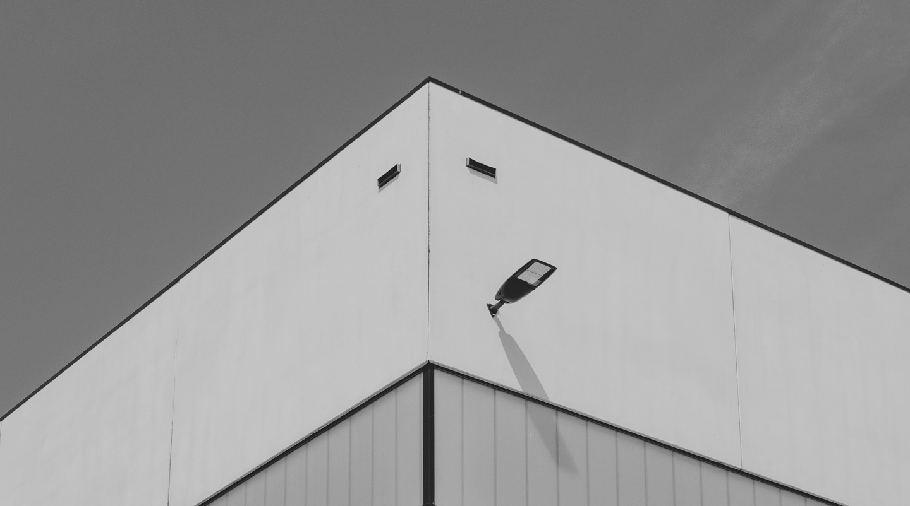
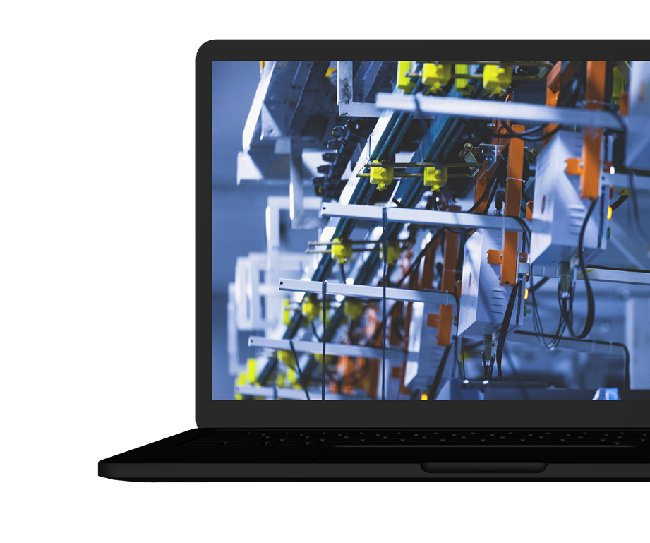

# ⚙️ PT Global Aspek Teknika - Industrial Solutions & Company Portal

> **Global Aspek Teknika (GAT) Web Portal** adalah platform sistem informasi company profile dan manajemen solusi industri modern (PLC Programming, Vision Inspection, Monitoring System, System Integrator, Laser Marking, & Strapping Machine). Dibangun dengan arsitektur **Laravel 12**, **Livewire 3**, **Volt**, dan **Flux UI** yang cepat, responsif, elegan, dan aman.

<p align="center">
  
  
  
  
  
  
  
  
  
</p>

---

## 🖥️ Preview & Showcase

<p align="center">
  
</p>

<br />

<p align="center">
  
</p>

---

## 📌 Project Metadata

| Informasi | Keterangan |
| :--- | :--- |
| **Nama Aplikasi** | **PT Global Aspek Teknika - Web Portal & Industrial Solutions** |
| **Deskripsi** | Website profil perusahaan dan portal solusi otomasi & integrasi sistem industri berbasis web modern. |
| **Pengembang** | **Muhammad Farhan Aprilianto** |
| **Pola Arsitektur** | **MVC (Model-View-Controller) + Single-File Livewire Volt Components** |
| **Backend Framework**| **Laravel 12.x** (PHP >= 8.2) |
| **Frontend & UI** | **Livewire 3, Volt, Flux UI, Blade Components, Tailwind CSS, Bootstrap 5** |
| **Database** | **MySQL / MariaDB / SQLite** |
| **Testing Suite** | **Pest PHP & PHPUnit** (Unit & Feature Tests - 100% Passed) |
| **Repository URL** | [github.com/MuhammadFarhanAprilianto/global-aspek-teknika-web](https://github.com/MuhammadFarhanAprilianto/global-aspek-teknika-web) |

---

## 🌟 Fitur Utama Berdasarkan Modul

```text
==================================================================================================
                               GLOBAL ASPEK TEKNIKA WEB ECOSYSTEM
==================================================================================================
  [ PUBLIC / COMPANY PROFILE ]                 [ ADMIN & USER MANAGEMENT ]
  ├── 🏠 Beranda & Hero Carousel Slider        ├── 🔐 Autentikasi Modern (Volt Single-File)
  ├── 🏢 Tentang Kami (Visi, Misi, Value)      ├── 📊 Dashboard Admin & Ringkasan Sistem
  ├── ⚙️ Katalog Solusi Industri:              ├── 📦 Manajemen Solusi & Katalog Produk
  │   ├── 🤖 PLC Programming                   ├── 👤 Pengaturan Profil Pengguna
  │   ├── 👁️ Vision Inspection                ├── 🔑 Manajemen Kata Sandi (Password)
  │   ├── 📈 Monitoring System                 ├── 🌓 Flux UI Theme (Light & Dark Mode)
  │   ├── 🔄 System Integrator                 └── 🛡️ Role-Based Access Control (RBAC)
  │   ├── ⚡ Laser Marking Machine
  │   └── 📦 Strapping Machine
  ├── 🛍️ Katalog Produk & Spesifikasi
  └── 📬 Formulir Kontak & Integrasi Email
==================================================================================================
```

### 1. 🏢 Modul Publik (Company Profile & Industrial Solutions)
- **Interactive Hero Carousel**: Menampilkan showcase inovasi otomatisasi digital dengan navigasi slider responsif.
- **Profil Perusahaan (About Us)**: Menguraikan sejarah, visi, misi, dan nilai-nilai keunggulan perusahaan.
- **Katalog Solusi Terintegrasi**: Halaman komprehensif untuk setiap lini solusi industri (PLC, Inspection, Monitoring, System Integrator, Laser Marking, Strapping).
- **Formulir Kontak Terhubung**: Pengunjung dapat mengirimkan pesan langsung ke email perusahaan melalui form yang tervalidasi secara aman.

### 2. 🛡️ Modul Admin & User Management
- **Autentikasi Cepat & Aman**: Login, registrasi akun, pemulihan kata sandi (forgot/reset password), konfirmasi password, dan verifikasi email berbasis Livewire Volt.
- **Admin Dashboard**: Panel kontrol terproteksi middleware `auth` dan `is_admin` untuk mengelola data solusi dan produk industri.
- **Pengaturan Akun & Keamanan**: Perubahan data profil, update password, serta opsi hapus akun secara mandiri.
- **Appearance Settings**: Dukungan tampilan *Light Mode* dan *Dark Mode* terintegrasi komponen Flux.

---

## 📂 Struktur Direktori Proyek

```text
website/
├── app/
│   ├── Http/
│   │   ├── Controllers/         # Controller Publik (Contact, Product, Solution)
│   │   └── Middleware/          # Middleware Aplikasi (IsAdmin, dll)
│   ├── Livewire/                # Komponen Livewire & Action Handlers
│   └── Models/                  # Eloquent Models (User, Solution, ContactUs)
├── config/                      # Konfigurasi Laravel
├── database/
│   ├── factories/               # Model Factories untuk Testing
│   ├── migrations/              # Skema Migrasi Database
│   └── seeders/                 # Database Seeders
├── docs/                        # Dokumentasi & Screenshot Showcase
│   └── screenshots/
├── public/                      # Entry Point Aplikasi & Storage Symlink
├── resources/
│   ├── css/                     # Styling Kustom & Tailwind CSS
│   ├── js/                      # Script JavaScript
│   └── views/                   # Blade Templates & Livewire Volt Views
│       ├── components/          # Reusable Layouts & UI Components
│       ├── livewire/            # Single-File Volt Components (Auth, Admin, Settings)
│       └── ...                  # Halaman Blade Publik (Home, About, Solution, dll.)
├── routes/
│   ├── auth.php                 # Rute Autentikasi Volt
│   ├── console.php              # Perintah Artisan Console
│   └── web.php                  # Rute Web Publik & Area Terproteksi
├── storage/                     # File Storage, Cache, & Logs (Git-ignored)
└── tests/
    ├── Feature/                 # Pengujian Fitur (Auth, Dashboard, Settings)
    └── Unit/                    # Pengujian Unit
```

---

## 🔒 Keamanan & Perlindungan Privasi Data

Proyek ini telah dikonfigurasi secara aman untuk publikasi di GitHub publik:
- **Kredensial & Secrets Terproteksi**: File environment asli (`.env`) beserta seluruh password email, database credentials, dan API key dikecualikan dari Git melalui `.gitignore`.
- **Template `.env.example` Bersih**: Tersedia template `.env.example` tanpa data rahasia untuk memudahkan *developer* lain dalam melakukan deployment mandiri.
- **Isolasi File Upload Pengguna**: File unggahan dinamis tidak disertakan dalam repository publik.

---

## 🚀 Panduan Instalasi Lokal

### 1. Prasyarat Sistem
- PHP >= 8.2
- Composer
- Node.js & NPM
- MySQL / MariaDB

### 2. Kloning Repository
```bash
git clone https://github.com/MuhammadFarhanAprilianto/global-aspek-teknika-web.git
cd global-aspek-teknika-web
```

### 3. Instalasi Dependensi
```bash
composer install
npm install
```

### 4. Konfigurasi Environment
Salin file template environment dan buat application key:
```bash
cp .env.example .env
php artisan key:generate
```

Sesuaikan konfigurasi database pada file `.env`:
```env
DB_CONNECTION=mysql
DB_HOST=127.0.0.1
DB_PORT=3306
DB_DATABASE=web_db
DB_USERNAME=root
DB_PASSWORD=
```

### 5. Jalankan Migrasi Database & Storage Link
```bash
php artisan migrate
php artisan storage:link
```

### 6. Jalankan Server Development
```bash
# Jalankan frontend asset builder
npm run dev

# Jalankan server backend Laravel (di terminal terpisah)
php artisan serve
```
Akses aplikasi melalui browser di **`http://127.0.0.1:8000`**.

---

## 🧪 Pengujian Otomatis (Automated Testing)

Aplikasi telah dilengkapi dengan rangkaian unit dan feature test otomatis menggunakan **Pest PHP**:

```bash
# Menjalankan seluruh test suite
./vendor/bin/pest

# Atau melalui artisan
php artisan test
```

Hasil pengujian saat ini:
```text
✓ Tests\Unit\ExampleTest
✓ Tests\Feature\Auth\AuthenticationTest
✓ Tests\Feature\Auth\EmailVerificationTest
✓ Tests\Feature\Auth\PasswordConfirmationTest
✓ Tests\Feature\Auth\PasswordResetTest
✓ Tests\Feature\Auth\RegistrationTest
✓ Tests\Feature\DashboardTest
✓ Tests\Feature\Settings\PasswordUpdateTest
✓ Tests\Feature\Settings\ProfileUpdateTest

Tests: 27 passed (61 assertions)
```

---

## 📄 Lisensi

Proyek ini dirilis di bawah lisensi [MIT License](LICENSE).

---

<p align="center">
  Dibuat dengan ❤️ oleh <strong><a href="https://github.com/MuhammadFarhanAprilianto">Muhammad Farhan Aprilianto</a></strong>
</p>
